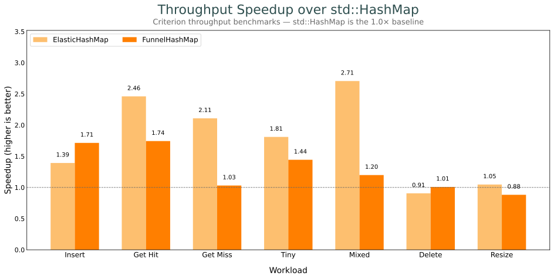
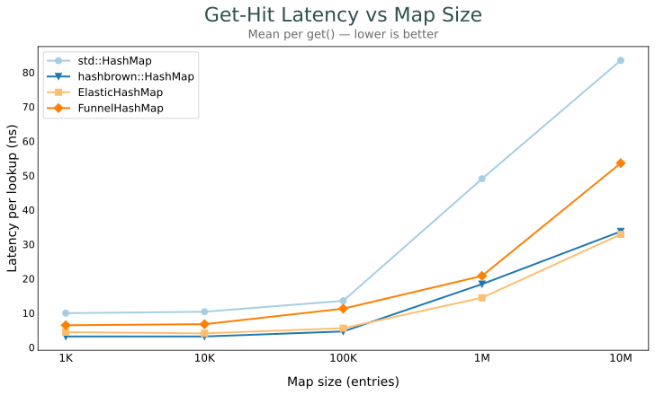
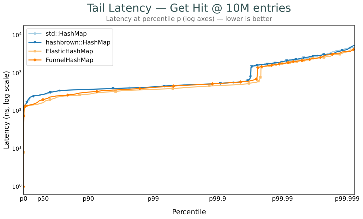
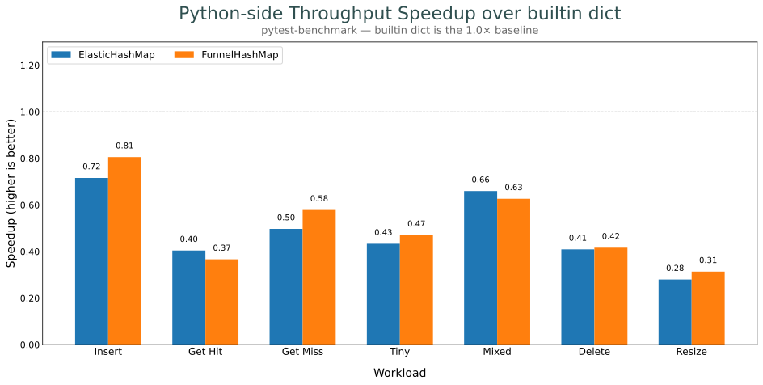

# Benchmarking

Rust bench targets compare `std::collections::HashMap`, `hashbrown::HashMap`, `opthash::ElasticHashMap`, `opthash::FunnelHashMap`. Shared fixtures live in `benches/common.rs`. Python-side benches under `benches/python/` compare the opthash bindings against builtin `dict`.

## Results

### Throughput (Rust, vs `std::HashMap`)



### Mean latency by map size (Rust)



### Tail latency distribution (Rust)



### Python: opthash bindings vs builtin `dict`



## `benches/speedup.rs` — throughput (Criterion)

Each group runs `std` / `hashbrown` / `elastic` / `funnel` side-by-side.

| axis     | groups                                                                         |
| -------- | ------------------------------------------------------------------------------ |
| insert   | `insert`, `grow_insert`, `insert_big`                                          |
| lookup   | `get_hit`, `get_miss`, `tiny_lookup`, `get_hit_big`, `get_hit_load_{50,75,90}` |
| mutate   | `mixed`, `delete`, `resize`, `replace`, `extend`, `entry`                      |
| iter     | `iter`, `iter_mut`, `drain`, `drain_big`, `extract_if`                         |
| capacity | `shrink_to_fit`, `clear_drop`                                                  |

`*_big` variants use a 32-byte (`[u64; 4]`) value to exercise the memcpy axis; pair with the `(u64, u64)` counterpart to attribute deltas. `clear_drop` uses a `Drop`-bearing payload so LLVM can't elide the walk.

```bash
cargo bench --bench speedup
cargo bench --bench speedup -- "get_hit"          # Criterion name filter
```

[.github/workflows/codspeed.yml](../.github/workflows/codspeed.yml) re-runs this bench under callgrind simulation per PR for deterministic instruction-count diffs.

## `benches/mean_latency.rs` — mean per-lookup latency by map size (Criterion)

Sweeps `get_hit` across `LATENCY_SIZES` (1K → 10M) so the cache-hierarchy cliffs (L1 → L2 → L3 → DRAM) show up as visible jumps in the chart. Local-only.

```bash
cargo bench --bench mean_latency
uv run --group charts scripts/generate_latency_chart.py
```

## `benches/tail_latency.rs` — tail-latency histograms (hdrhistogram)

HDR sampling at SIZE=10M. Writes percentiles + bucket counts to `target/latency/<map>/<size>/<op>.json`. Local-only.

```bash
cargo bench --bench tail_latency
```

## `benches/python/throughput.py` — Python bindings vs builtin `dict` (pytest-benchmark)

End-to-end workloads. Each opthash op crosses the GIL → `HashedAny::hash()` → Python bytecode, so this measures binding overhead as well as the map.

```bash
pytest benches/python/throughput.py --benchmark-json=.benchmarks/python.json
uv run --group charts python scripts/generate_python_chart.py
```

## `benches/python/binding_overhead.py` — per-op binding overhead

Decomposes one `m[k]` call: `loop -> hash(k) -> dict[k] -> __contains__ -> __getitem__ -> .get()`. Δ between rows attributes each primitive's ns cost. Run with `python benches/python/binding_overhead.py`.

For symbol-level attribution, drive a hot loop under `py-spy --native` and aggregate the folded-stack output:

```bash
py-spy record --native --rate 1000 --duration 8 \
  --format raw --output /tmp/perf_raw.txt -- \
  python benches/python/binding_overhead.py
```

## Reports

- Criterion HTML: `target/criterion/report/index.html`, per-workload pages below (e.g. `target/criterion/insert_throughput/report/index.html`)
- Charts: `uv run scripts/generate_all_charts.py` writes every SVG to `assets/` (speedup bars, mean-latency line, tail CDF, Python speedup bars)

## Profiling / flamegraphs

`benches/speedup.rs` integrates a `pprof` profiler. Pass `--profile-time N` and Criterion captures CPU samples instead of timing, writing `target/criterion/<workload>/<impl>/profile/flamegraph.svg`.

```bash
cargo bench --bench speedup -- --profile-time 5
cargo bench --bench speedup -- --profile-time 5 "get_hit"
```
